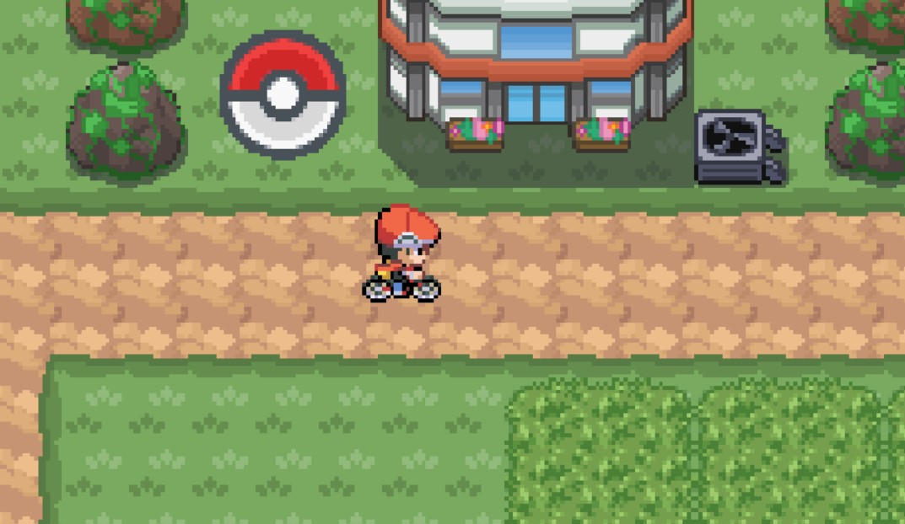

# Map for pokemon

# Pokémon Game in Python



This project is an implemantation of the classic
**Pokemon** game using the **Pygame** library.

🎮 Features

- Map with who can move it with your keyboard.
- Catch pokemon randomly in tall grass with pokeball after beat it.
- Sound effects for ma more immersive experience.
- The B key is used to ride the bike, and pressing B again dismounts the bike.

# Description

This project is a Pokémon game developed in Python. It allows players to capture, train, and battle with Pokémon in an interactive environment. The game includes several features inspired by the famous Pokémon franchise.

## Features

- Trainer selection and customization
- Pokémon capture system
- Pokémon battle mechanics
- Attack and health point management
- Storage for captured Pokémon
- Command-line interface with map

## Installation

Make sure you have Python installed (version 3.x recommended) before running the game.

### Installation Steps

1. Clone this repository or download the files:

   ```bash
   git clone https://github.com/AdelinePat/pokemon.git
   ```

2. Install dependencies if necessary:

   ```bash
   pip install pygame
   ```

   ```bash
   pip install pandas
   ```

   ```bash
   pip install pytmx
   ```

   ```bash
   pip install pyscroll
   ```

## Usage

1. Run `main.py` to start the game.
2. Follow the on-screen instructions to capture and train your Pokémon.
3. Participate in battles to improve your skills.

## Project Structure

```
📂 pokemon-game
├── 📁 assets/           # Graphics and sound resources
|      📁 back_end/         # Backend for Pokémon generation and JSON file handling
├── 📁 front_end/        # For battle system and graphical interface
├── 📁 new_menu/
|
├── README.md           # Project documentation
├── requirements.txt    # Python dependencies
|   .gitignore          # Files to exclude from version control
|__ main.py             # Main source code
```

# Contributing

This project was made by:

- [Adeline Patenne](https://github.com/AdelinePat/)
- [Florence Navet](https://github.com/florence-navet)
- [Thibault Manse](https://github.com/thibault-manse)
- [Joseph Dmytriyev ](https://github.com/joseph-Dmytrieyv)

### Licence

This project is licensed under the MIT License.

## Acknowledgments

Thanks to everyone contributing to the development of this game!
